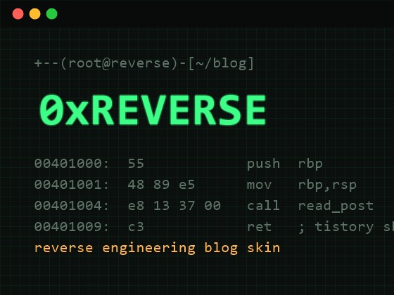

<div align="center">

# `0xREVERSE`

**리버스 엔지니어링 · 해커 터미널 컨셉의 다크 티스토리 스킨**

CRT 스캔라인 · 디스어셈블리 스타일 글 목록 · gdb 스택 프레임 댓글

[**▶ 라이브 데모**](https://176cm-developer.tistory.com) &nbsp;·&nbsp;
[**⬇ 다운로드**](https://github.com/KimJeju/0xREVERSE/releases/latest) &nbsp;·&nbsp;
[**📖 설치 가이드**](https://176cm-developer.tistory.com/entry/%ED%8B%B0%EC%8A%A4%ED%86%A0%EB%A6%AC-%EC%8A%A4%ED%82%A8-%EA%B0%9C%EB%B0%9C%EC%9E%90%C2%B7%EB%B3%B4%EC%95%88-%EB%B8%94%EB%A1%9C%EA%B7%B8%EB%A5%BC-%EC%9C%84%ED%95%9C-%EB%8B%A4%ED%81%AC-%EC%8A%A4%ED%82%A8-0xREVERSE-%EB%AC%B4%EB%A3%8C-%EB%B0%B0%ED%8F%AC)


[](https://github.com/KimJeju/0xREVERSE/stargazers)



```
┌──(root㉿reverse)-[~/blog]
└─# ./install 0xREVERSE.skin
[+] terminal header ......... ok
[+] disasm post listing ..... ok
[+] stack-frame comments .... ok
[+] konami easter egg ....... armed
```

</div>

---

## 왜 0xREVERSE인가

흔한 스킨은 예쁘지만 "나"를 말하지 않는다. 0xREVERSE는 첫 화면부터 방문자에게 이 블로그가 무엇을 다루는지 선언한다 — `root㉿reverse:~/blog#`. 보안·리버싱·개발 블로그를 위한, 컨셉이 뚜렷한 다크 스킨.

- **컨셉이 뚜렷하다** — 칼리 리눅스 프롬프트 헤더, 포스포 그린 팔레트, CRT 스캔라인
- **읽기 편하다** — 다크 톤이지만 본문 대비를 확보하고 코드블록·표·인용문 스타일을 전부 다듬음
- **가볍다** — 외부 프레임워크 없음. 순수 HTML/CSS/바닐라 JS (폰트 외 외부 요청 최소)
- **반응형 + 접근성** — 데스크톱 2단 / 모바일 1단 자동 전환, `prefers-reduced-motion` 지원

## 기능

| 영역 | 연출 |
|------|------|
| 헤더 | 터미널 창 + `objdump -d blog.bin` 타이핑 애니메이션 |
| 글 목록 | 디스어셈블리 리스팅 — 가상 주소 거터 `0x00401000` + `call` 니모닉 |
| 글 제목 | 마우스 호버 시 RGB 글리치 효과 |
| 코드블록 | `$ hexdump -C` 헤더가 달린 터미널 박스 |
| 댓글 | gdb 백트레이스처럼 쌓이는 스택 프레임 |
| 사이드바 | 검색 `/proc/search` · 카테고리 `readelf -S` · 최근글 `tail -f posts.log` · 방문자 `/proc/stat` |
| 이스터에그 | 코나미 커맨드(↑↑↓↓←→←→BA) 입력 시 매트릭스 레인 |

## 설치

티스토리 관리자 → **꾸미기 → 스킨 편집 → html 편집**

1. **HTML 탭**에 [`skin.html`](skin.html) 붙여넣기
2. **CSS 탭**에 [`style.css`](style.css) 붙여넣기
3. **파일 업로드 탭**에서 [`images/script.js`](images/script.js) 와 `preview*` 이미지 4개 업로드
4. 적용 후 저장

> 모바일에서도 이 디자인을 쓰려면 **관리자 → 꾸미기 → 모바일**에서 "티스토리 모바일웹 자동 적용"을 꺼주세요.

## 커스터마이즈

| 항목 | 위치 |
|------|------|
| 테마 색상 | `style.css` 최상단 `:root` CSS 변수 |
| 헤더 타이핑 문구 | `images/script.js` 의 `lines` 배열 |
| 프롬프트 호스트명 | `skin.html` 헤더의 `root㉿reverse` |

## 패치 노트

- **v1.0.2** — 댓글·방명록 프로필 이미지가 URL 텍스트로 출력되며 레이아웃이 깨지던 문제 수정 (로고 박스 크기 고정)
- **v1.0.1** — 카테고리 트리 흰 박스(이전 스킨 잔재) 강제 오버라이드, 사이드바 `whoami` GitHub 링크 추가
- **v1.0.0** — 최초 배포

## 라이선스

[MIT](LICENSE) — 자유롭게 사용·수정·재배포할 수 있습니다. 마음에 드셨다면 ⭐ 부탁드립니다.

<div align="center">

`skin: 0xREVERSE — reverse engineering blog skin`

</div>
